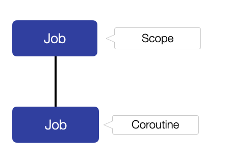
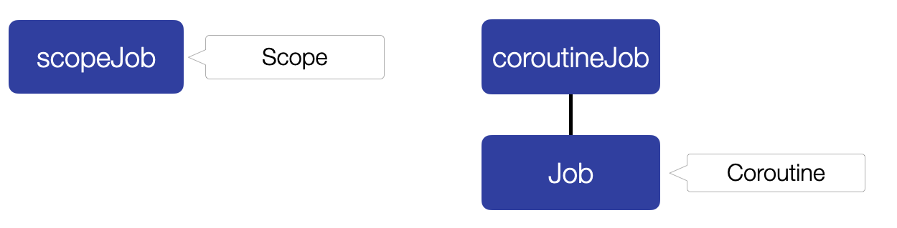

In my opinion, Kotlin Coroutines really simplify the way we write asynchronous and concurrent code. However, I identified some common mistakes that many developers make when using Coroutines.

## Common Mistake #1: Instantiating a new job instance when launching a Coroutine

Sometimes you need a `job` as a handle to your Coroutine in order to, for instance, cancel it later. And since the two Coroutine builders `launch{}` and `async{}` both take a `job` as input parameter, you might think about creating a new `job` instance and then pass this new instance to such a builder as `launch{}`. This way, you have a reference to the `job` and therefore are able to call methods like `.cancel()` on it.

```kotlin
fun main() = runBlocking {

    val coroutineJob = Job()
    launch(coroutineJob) {
        println("performing some work in Coroutine")
        delay(100)
    }.invokeOnCompletion { throwable ->
        if (throwable is CancellationException) {
            println("Coroutine was cancelled")
        }
    }

    // cancel job while Coroutine performs work
    delay(50)
    coroutineJob.cancel()
}
```

This code seems to be fine. When we run it, the Coroutine gets cancelled successfully:

```text
performing some work in Coroutine
Coroutine was cancelled

Process finished with exit code 0
```

However, let’s now run this Coroutine in a `CoroutineScope` and cancel this scope instead of the Coroutine’s `job`:

```kotlin
fun main() = runBlocking {

    val scopeJob = Job()
    val scope = CoroutineScope(scopeJob)

    val coroutineJob = Job()
    scope.launch(coroutineJob) {
        println("performing some work in Coroutine")
        delay(100)
    }.invokeOnCompletion { throwable ->
        if (throwable is CancellationException) {
            println("Coroutine was cancelled")
        }
    }

    // cancel scope while Coroutine performs work
    delay(50)
    scope.cancel()
}
```

All Coroutines in a scope should be cancelled when the scope itself gets cancelled. However, when we run this updated code example, this is not the case:

```text
performing some work in Coroutine

Process finished with exit code 0
```

Now, the Coroutine is _not_ cancelled, as “Coroutine was cancelled” is never printed out.

Why is that?

Well, in order to make your asynchronous and concurrent code safer, Coroutines have this innovative feature called “Structured Concurrency”. One mechanism of “Structured Concurrency” is to cancel all Coroutines of a `CoroutineScope` if the scope gets cancelled. In order for this mechanism to work, a hierarchy between the Scope’s `job` and the Coroutine’s `job` is formed, as the image below illustrates:



In our case however, something very unexpected happens. By passing your _own_ `Job` instance to the `launch()` Coroutine builder, we _don’t_ actually define this new instance as the `Job` that is associated with the Coroutine itself! Instead, it becomes the _parent_ job of the new coroutine. So the parent of our new Coroutine is not the `Coroutine Scope`‘s `job`, but our newly instantiated `job` object.

Therefore, the `job` of the Coroutine isn’t connected to the `job` of the `CoroutineScope` anymore:



So we _broke_ Structured Concurrency and therefore the Coroutine is not cancelled anymore when the we cancel our scope.

The solution for this problem is to simply use the `job` that `launch{}` returns as a handle for our Coroutine:

```kotlin
fun main() = runBlocking {
    val scopeJob = Job()
    val scope = CoroutineScope(scopeJob)

    val coroutineJob = scope.launch {
        println("performing some work in Coroutine")
        delay(100)
    }.invokeOnCompletion { throwable ->
        if (throwable is CancellationException) {
            println("Coroutine was cancelled")
        }
    }

    // cancel while coroutine performs work
    delay(50)
    scope.cancel()
}
```

This way, our Coroutine now is cancelled when the Scope is cancelled:

```text
performing some work in Coroutine
Coroutine was cancelled

Process finished with exit code 0
```

* * *

## Common Mistake #2: Installing SupervisorJob the wrong way

Sometimes you want to install a `SupervisorJob` somewhere in your job hierarchy in order to

1.  stop exceptions from propagating up the job hierarchy
2.  not cancel the siblings of Coroutines if one of them fails

Since the Coroutine builders `launch{}` and `async{}` can take a `Job` as an input parameter, you could think about achieving this by passing a `SupervisorJob` to these builders:

```kotlin
launch(SupervisorJob()){
    // Coroutine Body
}
```

However, like in Mistake#1, you are breaking the cancellation mechanism of Structured Concurrency. The solution for this issue is to use the `supervisorScope{}` scoping function instead:

```kotlin
supervisorScope {
    launch {
        // Coroutine Body
    }
}
```

* * *

## Common Mistake #3: Not supporting cancellation

Let’s say you want to perform an expensive operation, like the calculation of a factorial number, in your own `suspend` function:

```kotlin
// factorial of n (n!) = 1 * 2 * 3 * 4 * ... * n
suspend fun calculateFactorialOf(number: Int): BigInteger =
    withContext(Dispatchers.Default) {
        var factorial = BigInteger.ONE
        for (i in 1..number) {
            factorial = factorial.multiply(BigInteger.valueOf(i.toLong()))
        }
        factorial
    }
```

This suspend function has a problem: It doesn’t support “cooperative cancellation”. This means that even if the coroutine in which it is executed is cancelled prematurely, it will still continue to run until the calculation is completed. To avoid this issue, we periodically have to either use

*   [ensureActive()](https://kotlin.github.io/kotlinx.coroutines/kotlinx-coroutines-core/kotlinx.coroutines/ensure-active.html)
*   [isActive()](https://kotlin.github.io/kotlinx.coroutines/kotlinx-coroutines-core/kotlinx.coroutines/is-active.html)
*   or [yield()](https://kotlin.github.io/kotlinx.coroutines/kotlinx-coroutines-core/kotlinx.coroutines/yield.html)

Below, you can find a solution that supports cancellation by using [ensureActive()](https://kotlin.github.io/kotlinx.coroutines/kotlinx-coroutines-core/kotlinx.coroutines/ensure-active.html):

```kotlin
// factorial of n (n!) = 1 * 2 * 3 * 4 * ... * n
suspend fun calculateFactorialOf(number: Int): BigInteger =
    withContext(Dispatchers.Default) {
        var factorial = BigInteger.ONE
        for (i in 1..number) {
            ensureActive()
            factorial = factorial.multiply(BigInteger.valueOf(i.toLong()))
        }
        factorial
    }
```

The suspend functions in the Kotlin standard library (like e.g. \`delay()\`) are all cooperative regarding cancellation, but for your own suspend functions, you should never forget to think about cancellation.

