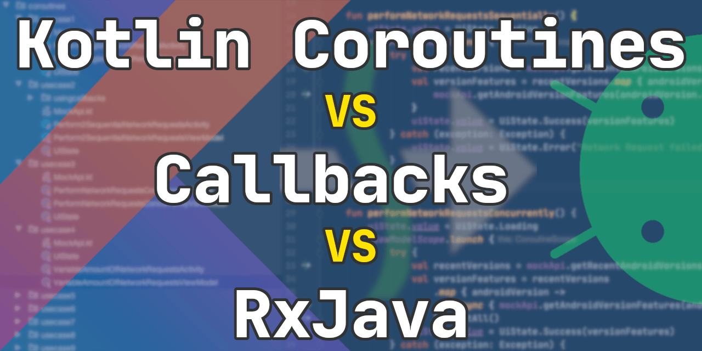
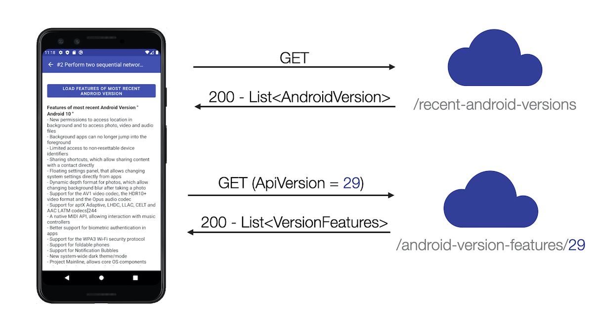

I am currently investing a lot of time in learning about Kotlin Coroutines 🎓. Therefore, I did some research about the most common use cases for using Coroutines on Android and implemented them in an \[[open-source example project](https://github.com/LukasLechnerDev/Kotlin-Coroutine-Use-Cases-on-Android)\]. It currently contains 16 common use cases implemented with Coroutines. I think the samples in this project can be helpful for lots of developers 👨‍💻.

To get a better understanding of the actual benefits of Coroutines, I also implemented two use cases with other approaches for asynchronous programming: Callbacks and RxJava. In this blog post, I want to show you the code of each approach to implement a simple use case so that you can compare them. Additionally, I discuss the various benefits and drawbacks of each approach and give you my personal findings of which approach is probably the best one for future Android projects.

## Simple Use Case: Perform two sequential network requests

The simple use case is about performing two sequential network requests against a predefined `MockAPI`. One that loads all recent Android versions and then another one that loads all the features of the most recent Android version. This feature list is then shown on the screen. If you want to clone the code yourself, check out use case [use case #2](https://github.com/LukasLechnerDev/Kotlin-Coroutine-Use-Cases-on-Android#2-perform-two-sequential-network-requests) in the [project](https://github.com/LukasLechnerDev/Kotlin-Coroutine-Use-Cases-on-Android).



## Callback Implementation

The project is structured in a way, that all the relevant source code for asynchronous programming is located in the `ViewModel` . Other “boilerplate” is mainly located in the `Activity`, which gets notified about certain events (Loading, Error, Success) by setting values on the `uiState` `LiveData` property of the `ViewModel`. Here is the code for the callback implementation:

```kotlin
class SequentialNetworkRequestsCallbacksViewModel(
    private val mockApi: CallbackMockApi = mockApi()
) : BaseViewModel<UiState>() {

    private var getAndroidVersionsCall: Call<List<AndroidVersion>>? = null
    private var getAndroidFeaturesCall: Call<VersionFeatures>? = null

    fun perform2SequentialNetworkRequest() {

        uiState.value = UiState.Loading

        getAndroidVersionsCall = mockApi.getRecentAndroidVersions()
        getAndroidVersionsCall!!.enqueue(object : Callback<List<AndroidVersion>> {
            override fun onFailure(call: Call<List<AndroidVersion>>, t: Throwable) {
                uiState.value = UiState.Error("Network Request failed")
            }

            override fun onResponse(
                call: Call<List<AndroidVersion>>,
                response: Response<List<AndroidVersion>>
            ) {
                if (response.isSuccessful) {
                    val mostRecentVersion = response.body()!!.last()
                    getAndroidFeaturesCall =
                        mockApi.getAndroidVersionFeatures(mostRecentVersion.apiVersion)
                    getAndroidFeaturesCall!!.enqueue(object : Callback<VersionFeatures> {
                        override fun onFailure(call: Call<VersionFeatures>, t: Throwable) {
                            uiState.value = UiState.Error("Network Request failed")
                        }

                        override fun onResponse(
                            call: Call<VersionFeatures>,
                            response: Response<VersionFeatures>
                        ) {
                            if (response.isSuccessful) {
                                val featuresOfMostRecentVersion = response.body()!!
                                uiState.value = UiState.Success(featuresOfMostRecentVersion)
                            } else {
                                uiState.value = UiState.Error("Network Request failed")
                            }
                        }
                    })
                } else {
                    uiState.value = UiState.Error("Network Request failed")
                }
            }
        })
    }

    override fun onCleared() {
        super.onCleared()

        getAndroidVersionsCall?.cancel()
        getAndroidFeaturesCall?.cancel()
    }
}
```

The implementation is quite verbose (56 lines) and difficult to read, because of the wide indentation of the `Callbacks`. Error handling is cumbersome, as we have to handle the error in 4 different places. We also must not forget to cancel the requests in `onCleared()`. Otherwise, we would get some serious memory leaks, as `ViewModel` and `Activity` instances would not be garbage collected as long as the requests haven’t finished.

## RxJava Implementation

```kotlin
class SequentialNetworkRequestsRxViewModel(
    private val mockApi: RxMockApi = mockApi()
) : BaseViewModel<UiState>() {

    private val disposables = CompositeDisposable()

    fun perform2SequentialNetworkRequest() {
        uiState.value = UiState.Loading

        mockApi.getRecentAndroidVersions()
            .flatMap { androidVersions ->
                val recentVersion = androidVersions.last()
                mockApi.getAndroidVersionFeatures(recentVersion.apiVersion)
            }
            .subscribeOn(Schedulers.io())
            .observeOn(AndroidSchedulers.mainThread())
            .subscribeBy(
                onSuccess = { featureVersions ->
                    uiState.value = UiState.Success(featureVersions)
                },
                onError = {
                    uiState.value = UiState.Error("Network Request failed.")
                }
            )
            .addTo(disposables)
    }

    override fun onCleared() {
        super.onCleared()
        disposables.clear()
    }
}
```

The RxJava implementation is much more concise (32 lines of code VS 56 lines of code in the callback implementation). I utilized some convenient functions of RxKotlin like `subscribeBy()` and `addTo()` to improve readability. If you have basic knowledge about RxJava, then this logic is easy to understand. Error handling is simple as errors are handled in a single place in the `onError()` function. We have to manually clear our disposables in `onCleared()` to avoid memory leaks.

## Coroutines Implementation

```kotlin
class Perform2SequentialNetworkRequestsViewModel(
    private val mockApi: MockApi = mockApi()
) : BaseViewModel<UiState>() {

    fun perform2SequentialNetworkRequest() {
        uiState.value = UiState.Loading
        viewModelScope.launch {
            try {
                val recentVersions = mockApi.getRecentAndroidVersions()
                val mostRecentVersion = recentVersions.last()

                val featuresOfMostRecentVersion =
                    mockApi.getAndroidVersionFeatures(mostRecentVersion.apiVersion)

                uiState.value = UiState.Success(featuresOfMostRecentVersion)
            } catch (exception: Exception) {
                uiState.value = UiState.Error("Network Request failed")
            }
        }
    }
}
```

The Coroutines-based implementation is the most concise one with 21 lines of code (RxJava implementation has 32, callback implementation has 56). Except for the code line in which a new coroutine is launched on the `viewModelScope`, every developer should be able to understand what the code is doing, even if he or she has no knowledge about Coroutines because the code is written in a sequential manner and only uses conventional coding constructs like `try-catch`. We also don’t need to think about cancellation and lifecycle management anymore, as the [`viewModelScope`](https://medium.com/androiddevelopers/easy-coroutines-in-android-viewmodelscope-25bffb605471) that is provided by Google takes care of all that.

## Now, what is the best approach for asynchronous programming? 🤔

What is the best way for us as professional developers to compare and evaluate different solutions for problems? I think statements like

*   "Callbacks are bad because of Callback Hell"
*   "RxJava is bad because it’s so hard for unexperienced developers to understand"
*   "Coroutines are the best approach, because it has nice syntax, is so concise and has the best readability"

are not sufficient to make professional decisions. We need something more profound.

## My methodology for making decisions about the usage of a certain solution

When making decisions in any serious software development project, I believe that the most important aspect is to assess at the **maintainability** of each of the potential solutions. But what does maintainability mean, exactly? While there are various different ways of defining maintainability, in my opinion it all comes down to this:

> The maintainability of a software project is **high**, if the amount of time it takes to make a change and the risk that this change will introduce new bugs are **low**.

This definition is not enough, though, because it is hard to answer the question of “Are callbacks, RxJava, or Coroutines better for the maintainability?” That’s why we have to take a look at some finer-grained properties of code quality that result in high maintainability. Then we are able to make a good evaluation. Let’s identify these properties and then assess which solution best fulfills them.

A code change needs to be made because of different reasons, such as fixing a bug or modifying or extending the behavior of the application. The amount of time it takes to make a change depends on

1.  The time needed to understand the code.
2.  The time needed to make the actual code change.

Good readability (I personally prefer the word comprehensibility) reduces the time needed to understand the code and make the change, which ultimately increases the maintainability of the software project. So we have the first property for our comparison: **comprehensibility**

The time needed to make the actual code change depends on the amount of code that needs to be changed. This depends on how flexible your code is for future changes. I call the second property of our evaluation **flexibility**

The risk that a change will introduce new bugs depends mainly on:

1.  The level of coupling between components. The danger of introducing new defects in spaghetti code with high coupling is much higher than in a well-decoupled project.
2.  The amount of test coverage. New bugs can be identified early on if an extensive test suite exists.

A good overall architecture leads to proper decoupling of components and a solid test strategy leads to proper test suites. The choice about how asynchronous programming is done in the application does not influence the level of coupling or the test coverage. With every approach (Callbacks, RxJava, and Coroutines) it is possible to have a properly decoupled architecture and an extensive test suite. That’s why I haven’t identified a reasonable property for our comparison in this category.

I identified the two properties **readability** and **flexibility** for my evaluation.

## Assessing Readability and Flexibility

In order to assess the **readability** of each approach, I just ask myself the question:

*   How long does it take to understand what the code is doing? The longer it takes to understand the code, the worse the readability.

In order to assess the **flexibility** of each approach, I think about how long it would take to make some hypothetical changes like:

1.  Perform a third network request, that loads detail information about each feature
2.  Load the features of the 2 most recent Android versions in parallel (instead of only the most recent feature)
3.  Retry network requests 2 times if they return an unsuccessful response.

The more code that needs to be written to accomplish these hypothetical changes, the less flexible the approach is.

## Evaluation of Callback based Solution

### Comprehensibility

Assessing the comprehensibility of the callback approach is a bit tricky. On the one hand, basically every developer with a basic understanding of Android, Kotlin, and Retrofit is able to understand what the code is doing because no knowledge about a specific framework is needed. So you don’t need to look up, for instance, how a `flatMap()` works in RxJava or what the `launch{}` Coroutine builder is doing. On the other hand, the deep nesting (Callback hell), the cumbersome error handling, and lifecycle management still make the code hard to reason about. Additionally, it is sometimes difficult to figure out on which thread the code in the callback is actually executed. This depends on the details of the implementation of the asynchronous function or in our case on Retrofit. We have to look up the [documentation](https://square.github.io/retrofit/2.x/retrofit/retrofit2/Callback.html) of the callback interface in order to find out that “Callbacks are executed on the application’s main (UI) thread”

### Flexibility

It is really tedious to modify the callback-based code in order to achieve the hypothetical changes stated above. If we need to make another network request to load details of some features, the Callback Hell would get even worse and error handling even more cumbersome. The lifecycle management will also need to be extended as we would need to cancel another request in `onCleared()` .

For the other two hypothetical changes just have a look at the [callback-based implementation](https://github.com/LukasLechnerDev/Kotlin-Coroutine-Use-Cases-on-Android/blob/master/app/src/main/java/com/lukaslechner/coroutineusecasesonandroid/usecases/coroutines/usecase7/callbacks/TimeoutAndRetryCallbackViewModel.kt) of a more complex use case in the [project](https://github.com/LukasLechnerDev/Kotlin-Coroutine-Use-Cases-on-Android), in which we perform two network requests in parallel and have `retry` and `timeout` behavior in place. A lot of additional code is needed, so the flexibility of the callback-based implementation is very bad.

## Evaluation of RxJava based Solution

### Comprehensibility

In order to assess the comprehensibility of the RxJava based solution, we have to classify users in two categories: developers with and without basic RxJava understanding. For engineers with basic RxJava understanding, it should be really easy to figure out what the code is doing. Developers without basic RxJava understanding will probably have a hard time understanding the code. They have to understand, what a `Single` is, what `flatMap()` does, how threading is controlled by `subscribeOn()` , and `observeOn()` and how error handling and lifecycle management works. We all know that learning RxJava is hard.

### Flexibility

To implement hypothetical change #1 (see above), an additional `flatMap()` in the stream is sufficient. For change #2 the `zip()` operator is needed. A `retry()` operator exits that should be enough to fulfill the requirements of change #3. All in all, the RxJava approach is very flexible. Changes are easy to make. You can check out the [RxJava Implementation](https://github.com/LukasLechnerDev/Kotlin-Coroutine-Use-Cases-on-Android/blob/master/app/src/main/java/com/lukaslechner/coroutineusecasesonandroid/usecases/coroutines/usecase7/rx/TimeoutAndRetryRxViewModel.kt) of a more complex use case.

## Evaluation of Coroutine based Solution

### Readability

Again, I think we need to distinguish between developers with and without knowledge about Coroutines. Engineers with Coroutine knowledge should not have a hard time figuring out how the implementation works. Developers without Coroutine knowledge have to do some research only about the `viewModelScope` and the `launch{}` Coroutine builder. All the other code is really easy to understand, even without Coroutine knowledge because it is ordinary, sequential code that contains only conventional constructs like `try-catch`. To illustrate that claim, lets have another look at the code in the Coroutine:

```kotlin
try {
    val recentVersions = mockApi.getRecentAndroidVersions()
    val mostRecentVersion = recentVersions.last()

    val featuresOfMostRecentVersion =
        mockApi.getAndroidVersionFeatures(mostRecentVersion.apiVersion)

    uiState.value = UiState.Success(featuresOfMostRecentVersion)
} catch (exception: Exception) {
    uiState.value = UiState.Error("Network Request failed")
}
```

Every developer should be able to understand this code. You don’t even have to figure out how lifecycle handling works, but simple trust that `viewModelScope()` is doing it correctly.

### Flexibility

In order to make an additional request, just a simple call to the Retrofit `suspend` function needs to be made. To perform network requests in parallel, use the `async()` coroutine builder, which is a bit nuanced in terms of error handling ([more information](https://medium.com/androiddevelopers/exceptions-in-coroutines-ce8da1ec060c)). A retry behavior can be easily implemented by creating a respective higher-order function. Take a look at the [Coroutine-based implementation](https://github.com/LukasLechnerDev/Kotlin-Coroutine-Use-Cases-on-Android/blob/master/app/src/main/java/com/lukaslechner/coroutineusecasesonandroid/usecases/coroutines/usecase7/TimeoutAndRetryViewModel.kt) to see how Coroutines “scale” in more complex situations.

## Ranking

I am ranking the approaches regarding **comprehensibility** in this order:

1.  Coroutines
2.  RxJava
3.  Callbacks

Coroutines are my winner here. It is – even for developers without knowledge about Coroutines – easy to figure out what the application is doing because code within Coroutines is just ordinary sequential code that is familiar to every developer. Sure, the callback-based approach is the leanest one, as you don’t need to include and learn any additional framework. However, I believe that it pays off massively to invest time in learning a framework like RxJava or Coroutines and refactor the very complex and error-prone callback-based code into something more comprehensible.

Here is my ranking regarding **flexibility**:

1.  Coroutines & RxJava
2.  Callbacks

Coroutines and RxJava provide the same level of flexibility in my opinion. With both frameworks, it is easy to make changes. Implementing more sophisticated use cases with callbacks gets complicated very quickly.

## Conclusion

In this blog post, I have shown implementations of a simple and a more complex use case with Callbacks, RxJava, and Coroutines. Then, I discussed the advantages and disadvantages. Next, I thought about how I could evaluate these different approaches and came to the conclusion, that it makes sense to rank them based on their level of comprehensibility and flexibility. Coroutines have the best comprehensibility and RxJava and Coroutines both have the same level of flexibility.

Based on these rankings, Kotlin Coroutines provide the best maintainability for a code base and are therefor the best choice for your next Android project. With them, it is possible to write the most comprehensible code, even for complex use cases. They are slightly easier to learn and understand than RxJava. However, I don’t think that Coroutines are a silver bullet, that make the complex nature of asynchronous and multithreaded code suddenly trivial. There are still nuances you need to know about Coroutines, like the [exact workings of error handling](https://medium.com/androiddevelopers/exceptions-in-coroutines-ce8da1ec060c).

Coroutines get promoted a lot by Google and most of androidx libraries get [built-in support](https://developer.android.com/topic/libraries/architecture/coroutines). They are not just a third-party library, but a native framework. They have first-party support from Jetbrains and Google. We can rely on quick bug fixes, continuing evolution and active improvements. In a couple of years, I expect that more Android developers will have knowledge about Coroutines than about RxJava. Therefore, it will be actually easier to find new team members that have experience with Coroutines than experience with RxJava, which is another reason to prefer Coroutines.

If you are happy using RxJava in your application, there is no need to invest in an expensive refactoring to Kotlin Coroutines. This is also the opinion of some experts from Google (check out the last part of this podcast: [187: Coroutines with Manuel Vivo & Sean McQuillan – Fragmented](https://fragmentedpodcast.com/episodes/187/)).

🎓 If you enjoyed this article, you probably also like my course about [Kotlin Coroutines and Flow for Android Development](https://lukaslechner.com/coroutines-flow-android?source=website):

[](https://lukaslechner.com/coroutines-flow-android?source=website)
