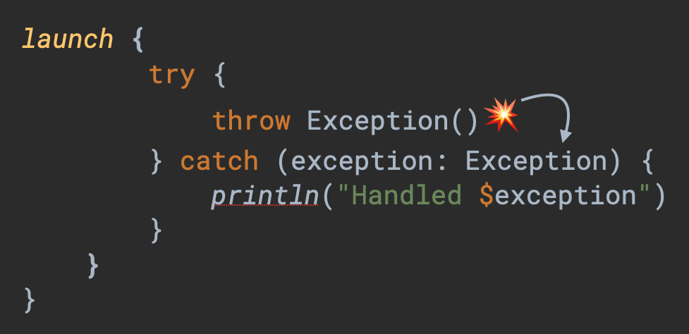
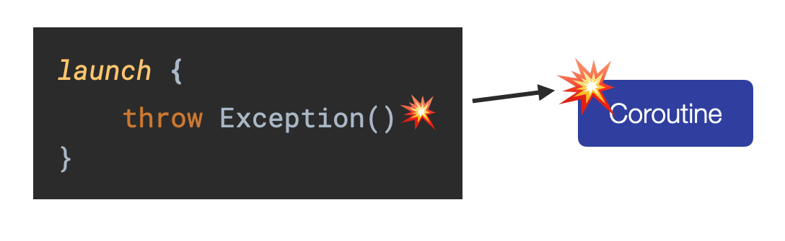
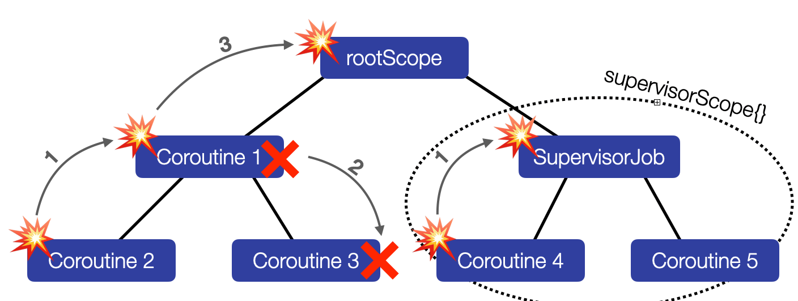
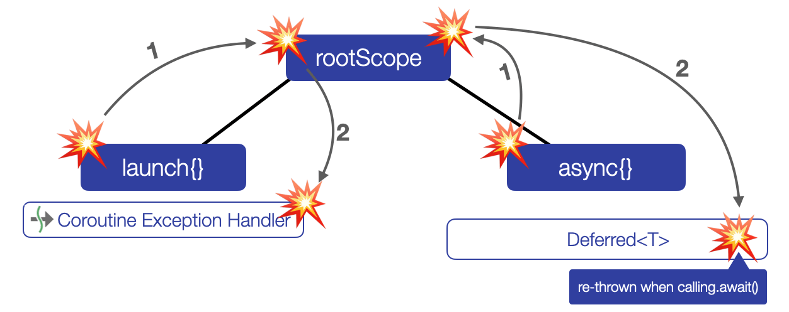
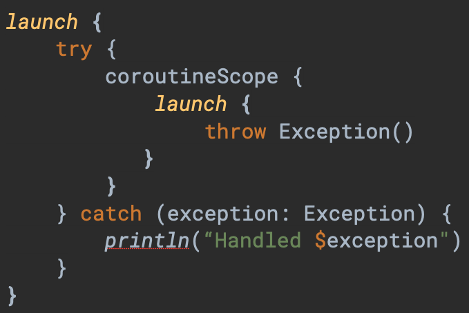

Exception Handling with Kotlin Coroutines is hard. I wrote an extensive [article](../why-exception-handling-with-kotlin-coroutines-is-so-hard-and-how-to-successfully-master-it/) about it and gave [talks](../talks/) about it at several conferences. Some developers suggested creating some kind of cheat sheet that could be helpful for implementing appropriate exception handling in coroutine-based code. Here it is 😉. It contains the six most important points. You can either download the PDF or read this article.

[👉 Download the Cheat Sheet as PDF](../downloads/Coroutines_Exception_Handling_Cheat_Sheet.pdf)

> You can watch an even more comprehensive video about Exception Handling in Kotlin Coroutines [here](https://youtu.be/Pgek3_3vPU8) !

* * *

**1) Exceptions can be handled directly in a Coroutine with a try-catch block. This way, the Coroutine doesn’t complete exceptionally.**

* * *

**2) If an exception is thrown in a Coroutine and not handled directly within the Coroutine with a try-catch block, the Coroutine completes exceptionally.**

* * *

**3) As a result, the exception is propagated up the job hierarchy until it reaches either the RootScope or a SupervisorJob. While the exception travels upwards, parent coroutines fail too and sibling coroutines get canceled.** 

* * *

**4) When the root coroutine was started with launch{}, the exception will be passed to an installed CoroutineExceptionHandler.** 

**When the root coroutine was started with async{}, the exception is encapsulated in the Deferred object.**

* * *

**5) The scoping function coroutineScope{} re-throws uncaught exceptions of its child Coroutines and so we can handle them with try/catch.**

* * *

**6) Keep in mind:** 

*   **When your Coroutine is not completing exceptionally, parent and sibling coroutines won’t be canceled.** 
*   **Suspend functions can throw a CancellationException at any point and by catching them, the Coroutine will keep on running.**

* * *

Btw: I also cover exception handling in great detail in my course [“Kotlin Coroutines and Flow for Android Development”](https://lukaslechner.com/coroutines-flow-android?source=website "\"Kotlin Coroutines and Flow for Android Development\"")

