In February 2020, Google released version [3.6](https://android-developers.googleblog.com/2020/02/android-studio-36.html) of Android Studio. It includes a new “Memory Leak Detection” feature. Does this mean that we don’t need the popular library for memory leak detection, [“Leak Canary”](https://square.github.io/leakcanary/), from Square anymore? I spent some time in the last couple of days playing around with the new Android Studio profiling feature and want to share my findings and thoughts here.

## The sample app

I created a [sample app](https://github.com/Lukle/Memory-Leak-Example) with an Activity called `LeakingActivity`. As the name indicates, this Activity demonstrates a common cause for a leak. It defines a `Listener` as an `inner class` and registers that `Listener` to an object with a longer lifecycle. In our case, this object is a Singleton that lives as long as the application lives. As we don’t unregister the listener when we navigate away from the Activity, the Singleton still keeps a reference to it even after the Android framework calls the `onDestroy()` method on it. The listener is an inner class of the Activity and therefore has an implicit reference to the Activity, which therefore won’t get garbage collected and no memory space will be freed up from it. This leads to an unnecessary hight memory usage at best and to your app crashing because of `java.lang.OutOfMemoryError`s in the worst case.

```kotlin
class LeakingActivity: AppCompatActivity() {

    private val listener = Listener()

    override fun onCreate(savedInstanceState: Bundle?) {
        super.onCreate(savedInstanceState)
        setContentView(R.layout.activity_leaking)
    }

    override fun onStart() {
        super.onStart()
        GlobalSingleton.register(listener)
    }

    override fun onStop() {
        super.onStop()
        
        // we forget to unregister our listener so a reference
        // of the Singleton to the listener and to the Activity
        // still exists after the user navigates away fro that
        // activity
        
        // GlobalSingleton.unregister(listener)
    }

    // inner class has implicit reference to enclosing Activity
    private inner class Listener : GlobalSingletonListener {
        override fun onEvent() { }
    }
}
```

```kotlin
object GlobalSingleton {

  	// a reference to the listener of the Activity is kept as long as 
    // unregister isn't called
    private val listeners = mutableListOf<GlobalSingletonListener>()

    fun register(listener: GlobalSingletonListener) {
        listeners.add(listener)
    }

    fun unregister(listener: GlobalSingletonListener) {
        listeners.remove(listener)
    }
}

interface GlobalSingletonListener {
    fun onEvent()
}
```

## Finding Memory Leaks with Android Studio 3.6

In order to check your app for leaks with the new “Leak Detection” feature, you will have to start the Android Studio Memory Profiler. If you are running the app on a device with Android 7.1 or lower, you have to [enable advanced profiling](https://developer.android.com/studio/profile/android-profiler#advanced-profiling) to see all profiling data. Click on “Profile app” in the navigation bar to install, launch and profile your app.


To start profiling an already running app, just click on “Profiler” in the bottom bar of Android Studio and then click the (+) to add your session:

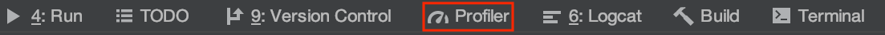

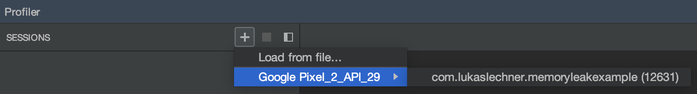

I switched to my emulator and opened and closed `LeakingActivity` twice. In the profiler, we see that `LeakingActivity` gets created and then destroyed.

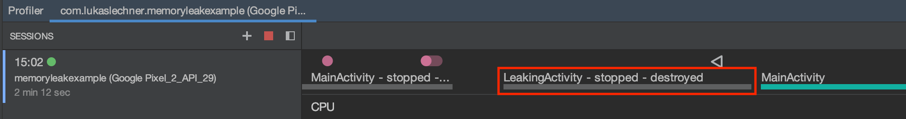

Now we want to find out whether this Activity was garbage collected or not. Therefore, we have to open the memory profiler by clicking on the memory lane, which is a bit unintuitive in my opinion. We see all the memory that was allocated for objects in different categories (Java, Native, Graphics …).

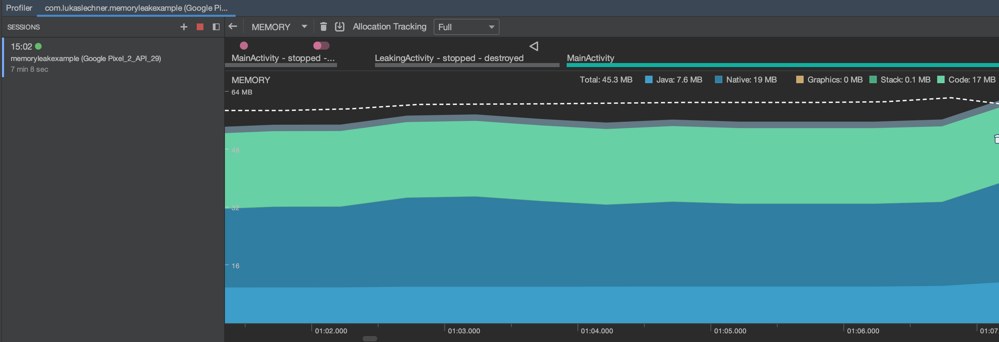

Next, we have to dump the Java heap by clicking on the  icon at the top. It makes sense to force a garbage collection by clicking on  first, just to make sure that garbage collection really happened. After the dump is completed, we can see all memory allocations:

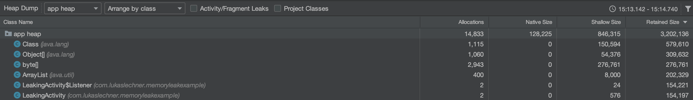

New in Android Studio 3.6. is the following Checkbox:


By checking this new checkbox we can see that our `LeakingActivity` leaked twice:

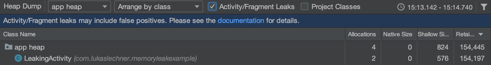

## Investigating the cause of our leak

The next thing we obviously want to do is to fix the leak. Memory leaks occur when references to “dead” objects that are no longer used still exist. We need to find these references and get rid of them. Let’s do some investigation by clicking on `LeakingActivity` to open the Instance View on the right-side panel.

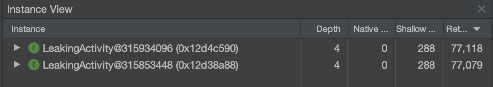

By clicking on the arrow in front of an instance we can see all the references to that instance in the “Reference View”:

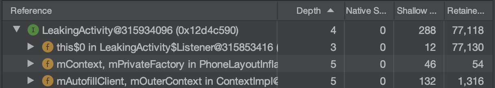

To be honest, I don’t exactly know what’s the best approach to find the exact reference path which caused the leak. I did some research to find out how LeakCanary gets the reference path that is causing the leak. In LeakCanary, this path is called “Leak Trace” and according to its [documentation](https://square.github.io/leakcanary/fundamentals-how-leakcanary-works/) it is the “_best strong reference path from garbage collection roots to a retained object_.” In other places, I read that it is the _shortest_ path. Garbage collection roots are objects that are never garbage collected (like the Application object, or in our case Singletons).

Update: Pierre-Yves Ricau, the author of LeakCanary thankfully clarified on twitter how the shortes path is computed:

https://twitter.com/Piwai/status/1244798627718914049

The retained object is `LeakingActivity`. I am not sure whether we can see the type of references (strong, weak, etc.) in the Instance View. However, we can order the references based on depth, which is according to the [memory profiler documentation](https://developer.android.com/studio/profile/memory-profiler#capture-heap-dump) _the “Shortest number of hops from any garbage-collection root to the selected instance”_.

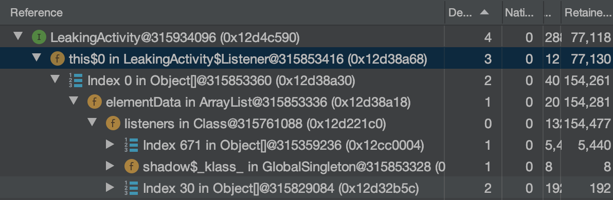

When we take a look at the first path of references with the shortest depth of 3, we can identify the following reference chain: `GlobalSingleton` (Garbage Collection root) has a reference to the `listener ArrayList` which has a reference to the `Listener` inner class of the Activity which has an (implicit) reference to `LeakingActivity`.

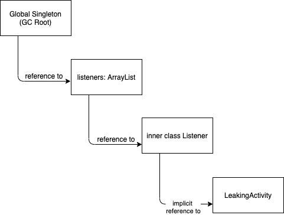

This looks suspicious, as the GlobalSingleton shouldn’t have a reference to a destroyed activity and then we realize that we forgot to unregister our listener.

```kotlin
class LeakingActivity: AppCompatActivity() {

    private val listener = Listener()

    ...

    override fun onStop() {
        super.onStop()
        
      	// fixing the leak by unregistering the listener
      	GlobalSingleton.unregister(listener)
    }

   ...
}
```

We found and fixed the leak with the new Android Studio Leak Detection feature! So we don’t need LeakCanary anymore, right?

## Is LeakCanary still useful?

Well, there are still a lot of benefits to using [LeakCanary](https://square.github.io/leakcanary/) to detect leaks.


First, LeakCanary _always_ monitors your app for leaks. With the Android Studio Profiler you have to _proactively_ monitor your app and as we all know, we as developers usually have a lot of other things to do and tend to do profiling “later” (aka never). LeakCanary constantly “reminds” you that you have some leaks left to fix, which increases the chances that you actually fix them.

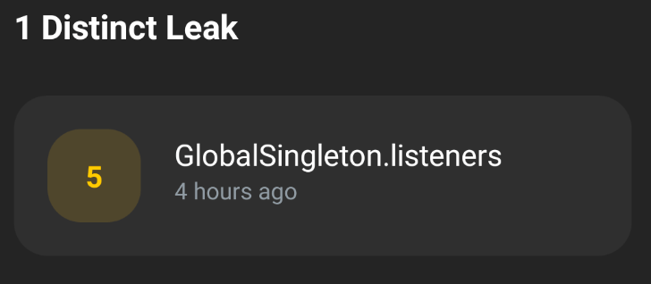

Second, with LeakCanary it is much easier to find the causes of your leaks. We don’t have to dig into the confusing “Reference View” of Android Studio, but get a nice “Leak Trace”. It even puts a red squiggly line below references that are most likely causing the leak.

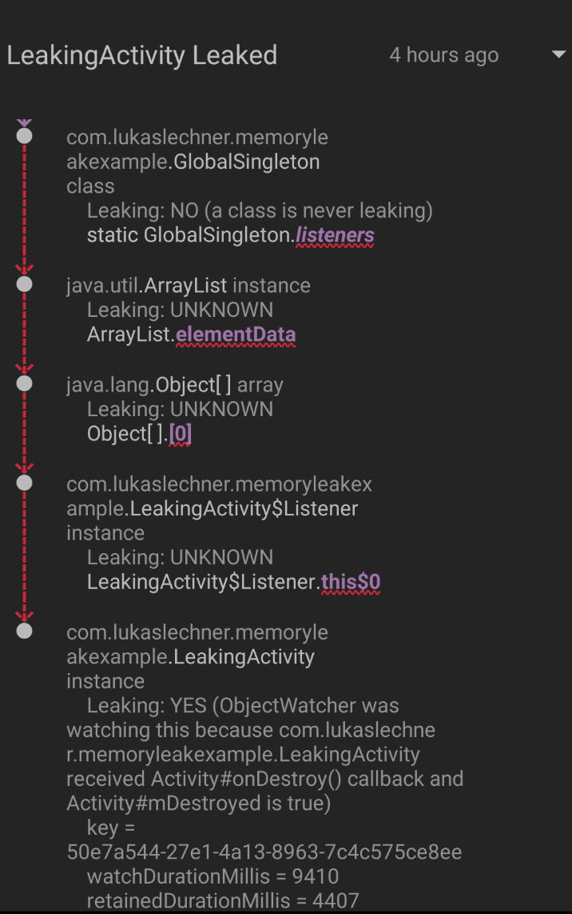

Third, LeakCanary has a collection of [known leaks in libraries and the Android framework](https://square.github.io/leakcanary/recipes/#matching-known-library-leaks) so it doesn’t show you leaks that are beyond your control to fix. Additionally, with LeakCanary you can’t only detect leaks from Activities or Fragments but also from any other object (e.g. Services or Dagger components) by [adding it to its `objectWatcher`](https://square.github.io/leakcanary/recipes/#watching-objects-with-a-lifecycle).

Additionally, other features like [counting retained objects in production](https://square.github.io/leakcanary/recipes/#counting-retained-instances-in-production) or [leak detection when running instrumentation tests](https://square.github.io/leakcanary/recipes/#running-leakcanary-in-instrumentation-tests) are really helpful as well.

## Conclusion

The new “Leak Detection” feature of Android Studio 3.6 is a nice and convenient way of detecting leaking Fragments and Activities without adding a 3rd-party library to your application. In my opinion, it can be sufficient to occasionally check small or hobby apps for leaks. Identifying the causes of memory leaks is not that easy though. For any production app that seriously cares about a low memory footprint and no `java.lang.OutOfMemoryError` crashes, I think there is no way around using LeakCanary. It constantly monitors your applications for memory leaks and, besides other helpful features, makes it very easy for developers to identify the causes of their memory leaks.
