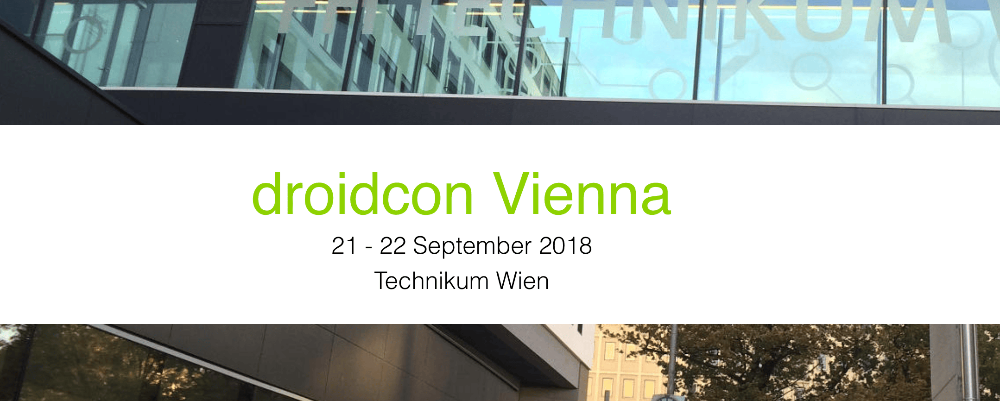

This is a short recap of [Droidcon Vienna](https://droidcon.at/), which took place on September the 21st and 22nd of 2018. I did a presentation for the first time at a conference so I was really excited. On the day before the event, we were invited to speakers dinner. It was very nice to get to know some of the other speakers. I was surprised by how international the speaker lineup was. I could speak with speakers from India, Singapur, Ireland, and the UK.

## Conference Day 1

#### Making change as an Ally

The opening keynote with the title “Making change as an ally” was given by [Joe Birch](https://medium.com/u/61b7f64f0302?source=post_page-----eaf861d05772----------------------). In this inspiring talk, he spoke about the topics of how to foster diversity and how to create an inclusive environment.

I really liked that the conference was started with this very important, non-technical and thought-provoking talk. That’s definitively something we as a (mostly “privileged”) developer community have to keep in mind to hopefully become a more diverse community altogether.

> I really enjoy giving this talk and all the questions / thoughts people share with me afterwards ♥️ If you're an organizer, I'd love to speak it at your event too! [https://t.co/3F5iZOUL2Z](https://t.co/3F5iZOUL2Z)
> 
> — Joe Birch (@hitherejoe) [September 21, 2018](https://twitter.com/hitherejoe/status/1043142216376623104?ref_src=twsrc%5Etfw)

#### From monolith to modular – our experience at Shpock

The next talk I attended had the title “From monolith to modular”, where Daniel Niedermühlbichler spoke about the experiences and challenges of his team about extracting logic into several small gradle modules. The main motivation for this was to decrease build time. Even though the clean build time did not improve, the incremental build time when only one of the new modules was changed dropped drastically (from I think 50 seconds to 11 seconds). He also said that in the future, they want to experiment with the gradle build cache server, where build caches from the continuous integration server could be distributed to developers to speed up the build. This is definitively something that sounds interesting.

#### Having fun with Kotlin fun()

In the next talk, Adnan A M talked about everything you need to know about functions in Kotlin (and having fun with them). He made a deep dive into language features like inner functions, single expression functions, top level functions, extension functions, lambda expressions and higher order functions. He also mentioned standard libary functions like also, apply (mutating functions), let and run (transforming functions) and gave some examples about where they are useful. I really liked those examples and I will definitively use them more often in the future now.

> Here are the slides from my talk "Having fun with Kotlin fun()" at [@droidconVIE](https://twitter.com/droidconVIE?ref_src=twsrc%5Etfw) ! This was so much fun() [#droidconvie](https://twitter.com/hashtag/droidconvie?src=hash&ref_src=twsrc%5Etfw) [https://t.co/3p3giLP804](https://t.co/3p3giLP804)
> 
> — Adnan A M (@AdnanM0123) [September 22, 2018](https://twitter.com/AdnanM0123/status/1043375203433291776?ref_src=twsrc%5Etfw)

#### Your phone is learning! Introduction to running Tensorflow on Android

In the very funny and interesting talk, [Bartosz Kraszewski](https://medium.com/u/38848ec379d4?source=post_page-----eaf861d05772----------------------) started with explaining what Machine Learning (ML) actually is. In ML, instead of the telling the computer explicitly what to do, we give him a lot of data, based on which he decides for himself how to solve a given problem. Then he introduced the audience to [tensorflow](https://www.tensorflow.org/), the most popular framework to do calculations regarding ML. He showed an example on how to detect numbers that are drawn on a smartphone display. In the real life, unfortunately, we as mobile app developers are most of the time just responsible for “collecting and preparing data”, while the data scientists and the backend team is actually doing the ML magic.

> Slides from my talk at [@droidconVIE](https://twitter.com/droidconVIE?ref_src=twsrc%5Etfw) [https://t.co/FljwG9nVVl](https://t.co/FljwG9nVVl)
> 
> — Bartosz Kraszewski (@BartoszKraszew1) [September 21, 2018](https://twitter.com/BartoszKraszew1/status/1043124994400833536?ref_src=twsrc%5Etfw)

#### Android App Performance

Then my coworker Konrad Pozniak spoke about a lot of different topics regarding improving the performance of Android applications. He covered topics like Strict Mode, Activity Manager log output, Frame Metrics, the Android Studio Performance Monitor, Google Play Vitals and Firebase Performance Monitoring.

He then talked about Proguard. He is a big fan of Proguard, because the performance gains (and also improved security) that it brings are significant. He mentioned that R8, the successor of Proguard, will be released soon and even more performance gains can be expected.

He also gave a lot of tips about how to optimize layouts, networking and your Java or Kotlin code in general.

He backed up all his statements with lots of benchmarks that he performed in preparation to the talk.

> The slides from my talk are online at [https://t.co/uFA5cc3Qqz](https://t.co/uFA5cc3Qqz) [#droidconVIE](https://twitter.com/hashtag/droidconVIE?src=hash&ref_src=twsrc%5Etfw) [@droidconVIE](https://twitter.com/droidconVIE?ref_src=twsrc%5Etfw)
> 
> — Connyy (@ConnyDuck) [September 21, 2018](https://twitter.com/ConnyDuck/status/1043140151520751616?ref_src=twsrc%5Etfw)

## Conference Day 2

#### Awesome Animations using ConstraintLayout and MotionLayout

In the first presentation, [Hari Vignesh Jayapalan](https://medium.com/u/3a55c349a920?source=post_page-----eaf861d05772----------------------) showed us some really impressive animations that can be done with not that much effort with Constraint Layout and Motion Layout. I really recommend you to check out his sample project: [https://github.com/Hariofspades/MotionLayoutExperiments](https://github.com/Hariofspades/MotionLayoutExperiments)

https://twitter.com/HariOfSpades/status/1043434446999961600

#### How ‘Effective Java’ influenced Kotlin

Then, It was my turn to speak about “How Effective Java influenced Kotlin”. If you are interested, you can read my [blogpost series](../how-effective-java-influenced-the-design-of-kotlin-part-1/) about it.

> [#droidconvie](https://twitter.com/hashtag/droidconvie?src=hash&ref_src=twsrc%5Etfw) Slides of my talk "How Effective Java influenced Kotlin" are online! [https://t.co/k6L4cX1g9A](https://t.co/k6L4cX1g9A)
> 
> — Lukas Lechner (@LukasLechnerDev) [September 22, 2018](https://twitter.com/LukasLechnerDev/status/1043445623788322817?ref_src=twsrc%5Etfw)

#### **Building a Google Keep clone with React Native**

The last talk was then held by [Juarez Filho](https://medium.com/u/83fa6384842b?source=post_page-----eaf861d05772----------------------). He talked about how to write a simple app with React Native in combination with Firebase.

The event closed with some “barcamp” sessions about wide-ranging topics like RxJava Operators, Penetration Testing, Hiring and Multi Module tips and tricks.

I really enjoyed the event, learned lots of new things and met a lot of experienced developers. I am looking forward to Droidon 2019. 👊
