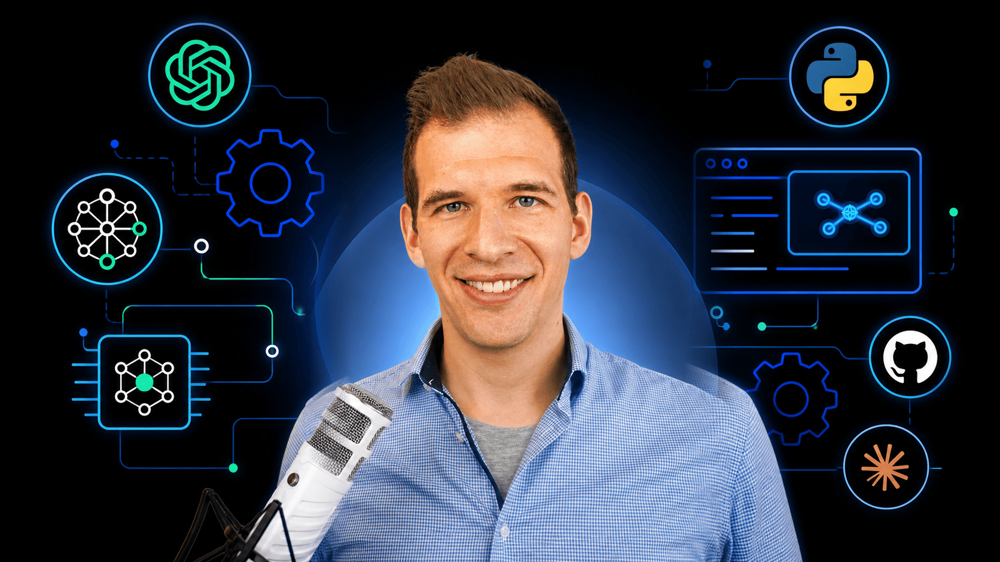

I released a new course “AI Engineering Fundamentals”.

👉 [https://www.udemy.com/course/ai-engineering-fundamentals-build-real-llm-apps-in-python/?referralCode=D1BA2721D48381A98F83](https://www.udemy.com/course/ai-engineering-fundamentals-build-real-llm-apps-in-python/?referralCode=D1BA2721D48381A98F83)

Below you can find the story about my transition 👇

Many Android Developers know me as the “Coroutines & Flow Guy”, since I have the most popular udemy course on that topic.

What few people know is that I haven’t worked as an Android Developer for more than 3 years now.

Why? Because in early 2023, I decided to transition to Backend Development simply because there is much greater demand and higher earning potential for Spring Boot Developers than for native Android Developers.

With quite a bit of luck, I quickly secured a long-running freelance contract as a Backend Developer for a big e-commerce business here in Austria. I was really happy in that project, and in my third year, I envisioned working there for many more years.

However, things can change quickly, and within a day, the company announced that it would completely shut down the service my team was working on by the end of 2025.

One part of me was really sad because I really liked the team and the product we worked on. But another part of me was excited because I had always wanted to find out if I could live off online courses, and now I “got” my chance.

Initially, my plan was this: To create courses around how to become a Backend Developer. However, after starting with the first course about Spring Boot, something didn’t feel right.

I didn’t feel I could sell enough courses on that topic, since there are already so many courses out there and many developers already have the knowledge my courses would teach.

I needed a new field, which is rather new, highly in demand, and for which not many people yet have the skills.

So I did another round of brainstorming and research, and suddenly “AI Engineering” emerged, which is all about building applications on top of LLMs. Initially, I dismissed it because I thought this was just about how to use the OpenAI API.

But boy was I wrong…

… because while it’s easy to build demos and prototypes that integrate LLMs, bringing them to production is what AI Engineering is all about.

In a demo, you can simply use the most powerful frontier model. In production, this would get very expensive, so you need to answer the question: What is the cheapest model that still gets the job done? Furthermore, in production, you have to optimize the context; otherwise, you will face high costs.

Also, in a demo, it’s okay to have low latency. In production, users expect quick responses. In a demo, you present the happy path. In production, users will use your app in ways you didn’t expect.

Also, you need good monitoring in place, so you always know whether your AI System is behaving correctly.

On top of that, there is a fundamental difference to classical software: LLMs are non-deterministic. The same input can produce different outputs every time. This creates entirely new challenges: how do you even know if your system is still working correctly after you change a prompt or switch to a newer model? The answer is evaluations, or “evals” for short. Evals are the unit tests of AI Engineers, and building good evals is one of the most important skills in this new field.

Furthermore, you need to master completely new concepts such as RAG (Retrieval-Augmented Generation) and new frameworks such as LangChain and LangGraph.

Everybody is talking about how AI will replace lots of white-collar jobs. But who is going to develop all the required automations? Right, the AI Engineer. So AI Engineering is probably one of the most future-proof fields in Software Development.

The LinkedIn Jobs on the Rise Report from 2026 states that the AI Engineer is the #1 fastest-growing job role right now.  

So in February, I decided to go all in on AI Engineering and started working on my first course. Today, after 6 months of hard work, I can proudly announce that the first version of “AI Engineering Fundamentals” is out now on udemy

👉 [https://www.udemy.com/course/ai-engineering-fundamentals-build-real-llm-apps-in-python/?referralCode=D1BA2721D48381A98F83](https://www.udemy.com/course/ai-engineering-fundamentals-build-real-llm-apps-in-python/?referralCode=D1BA2721D48381A98F83)

The course is currently in an “MVP” state, but it already contains about 7 hours of content and more than 50 videos. However, I will spend the rest of the year adding new modules to it, which you will receive automatically for free once you enroll.

Thanks for reading, and if you want to dive deeper into AI Engineering, then check out my course :).
