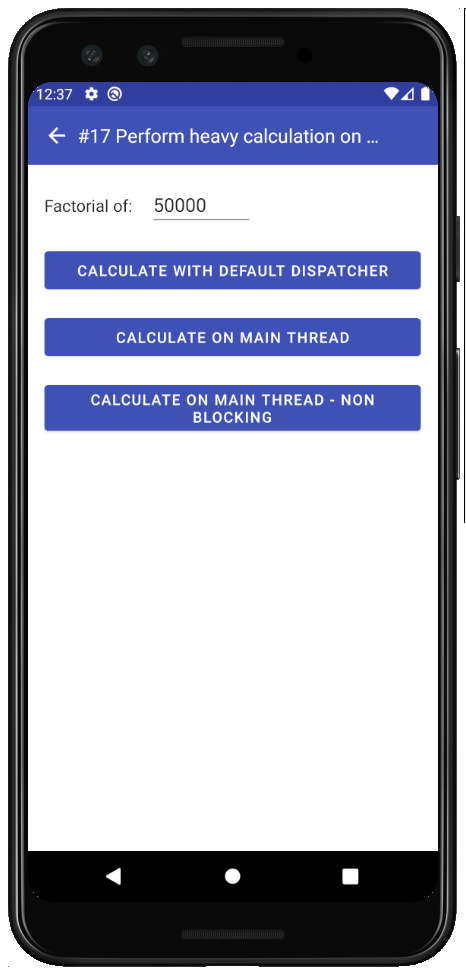
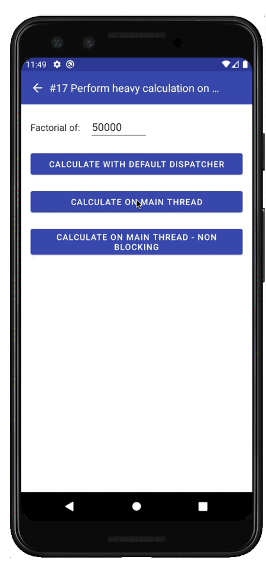
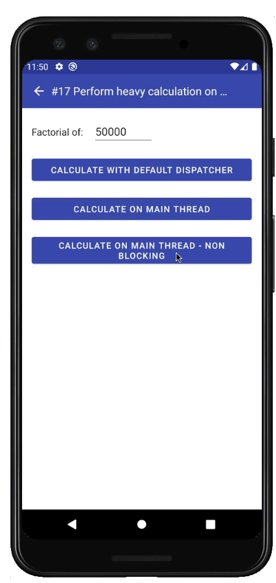
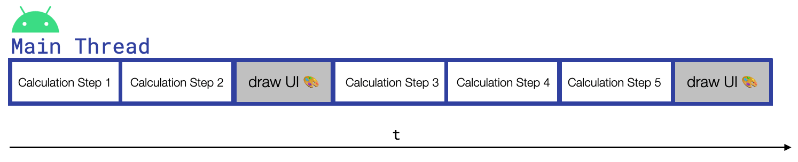
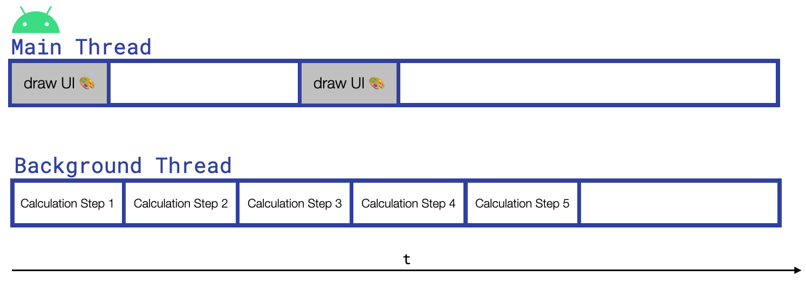

On Android, you should usually perform CPU-intensive tasks on a background thread. Otherwise, if we perform them on the main thread, the UI freezes and gets unresponsive. With Coroutines, however, it is possible to perform expensive computations without ever leaving the main thread and without impacting the functionality of the UI. In this blog post, I show you how this is possible. However, I will also tell you why you should never follow this approach in a real production app.

## The example project

The example I use for this blog post is `UseCase#17` of my [sample project](https://github.com/LukasLechnerDev/Kotlin-Coroutine-Use-Cases-on-Android) about Coroutines. It calculates the [factorial](https://en.wikipedia.org/wiki/Factorial) of a user-defined number in different ways. All code is located in this [ViewModel](https://github.com/LukasLechnerDev/Kotlin-Coroutine-Use-Cases-on-Android/blob/master/app/src/main/java/com/lukaslechner/coroutineusecasesonandroid/usecases/coroutines/usecase17/PerformCalculationOnMainThreadViewModel.kt) When you run the app and go to `UseCase#17`, you see the following UI:



By clicking on the different buttons, the factorial is either calculated on

*   a background thread using the default dispatcher
*   the main thread that freezes the UI
*   the main thread without freezing the UI

While the calculation is in progress, the app shows a progress bar. After the result has been calculated, the UI shows how long the computation took.

## The right way: Using the Default Dispatcher

The proper way to perform an expensive computation on Android using Coroutines is to use the default dispatcher (`Dispatchers.Default`). This dispatcher is optimised for CPU intensive tasks. It dispatches work to a thread pool that consists of as many threads as there are CPU cores available, but at least 2.

```kotlin
private suspend fun calculateFactorialOnDefaultDispatcher(number: Int): BigInteger =
    withContext(Dispatchers.Default) {
        var factorial = BigInteger.ONE
        for (i in 1..number) {
            factorial = factorial.multiply(BigInteger.valueOf(i.toLong()))
        }
        factorial
    }
```

In this code example, we use the `withContext()` construct to define the default dispatcher for the calculation. When we run this code, the progress bar runs smoothly, so the main thread is not blocked and can render each frame without a problem.


## The wrong way: Performing the calculation on Main Thread

This is the code that performs the calculation directly on the main thread:

```kotlin
private fun calculateFactorialInMainThread(number: Int): BigInteger {
    var factorial = BigInteger.ONE
    for (i in 1..number) {
        factorial = factorial.multiply(BigInteger.valueOf(i.toLong()))
    }
    return factorial
}
```

The function is just a regular one and not a `suspend` function. Therefore we don’t actually need to call it from a coroutine. Here, the main thread gets blocked while the calculation is running and so the UI freezes and gets unresponsive. The progress bar is not even showing up:



Additionally, LogCat warns us that the UI was not able to draw some frames:

> I/Choreographer: Skipped 42 frames! The application may be doing too much work on its main thread.

## The interesting (but very inefficient and slow) way: Performing the calculation on Main Thread without freezing the UI.

There is a way to use Coroutines to run the calculation on the main thread without freezing the UI! How is this possible? It can be accomplished by usage of the `suspend` function [yield](https://kotlin.github.io/kotlinx.coroutines/kotlinx-coroutines-core/kotlinx.coroutines/yield.html).

```kotlin
private suspend fun calculateFactorialInMainThreadUsingYield(number: Int): BigInteger {
    var factorial = BigInteger.ONE
    for (i in 1..number) {
        yield()
        factorial = factorial.multiply(BigInteger.valueOf(i.toLong()))
    }
    return factorial
}
```

When we execute this code, the UI stays fluid and the [Android Choreographer](https://developer.android.com/reference/android/view/Choreographer) is not complaining in LogCat about skipped frames. However, the calculation takes twice as long as in the previous examples.



What’s going on? Here, `yield` is called before every calculation step to allow other work, like drawing the UI, to be performed on the current (main) thread. It basically hands-off control after every computation step. The code in the coroutine is basically disassembled into lots of small calculation steps, that are executed whenever the main thread has time to execute them.



## `yield()` under the hood

We are using the `viewModelScope` in this example, and therefore the code is executed using the Android main dispatcher (`Dispatchers.Main`). As I have written in another [article](../understanding-kotlin-coroutines-with-this-mental-model/), the Android main dispatcher uses a simple [Handler](https://developer.android.com/reference/android/os/Handler) internally to post Runnables to the [MessageQueue](https://developer.android.com/reference/android/os/MessageQueue) so that the Android framework executes them on the main thread. When using `yield()`, the coroutine is suspended, and a method called `dispatch()` in [kotlinx.coroutines/HandlerDispatcher.kt](https://github.com/Kotlin/kotlinx.coroutines/blob/master/ui/kotlinx-coroutines-android/src/HandlerDispatcher.kt) is executed:

```kotlin
override fun dispatch(context: 	CoroutineContext, block: Runnable) {
    handler.post(block)
}
```

`block` represents the next step of the calculation and the `handler` puts it into the MessageQueue. After `block` gets executed, the next calculation step gets posted with the `handler` . This process continues until all calculation steps got processed. In between these processing steps, the [Android Choreographer](https://developer.android.com/reference/android/view/Choreographer) also puts messages to render the screen to the message queue and therefore the UI is drawn frequently enough.

For a UI to stay fluid, it has to be drawn 60 times per second, or every 16 milliseconds. This is because most phones have a display refresh rate of 60Hz. As long as a single calculation step does not take longer than 16ms, the UI won’t freeze.

## Concurrency VS Parallelism

This example showcases the concept of concurrency in a nice way. There is never actually more than one task performed at the same time. However, the execution switches between a lot of small tasks pretty frequently, so that we get the impression that they are running simultaneously. This can be visualised by the diagram from above:


Parallelism, on the other hand, is when more than one task gets actually executed /at the same time/. We had parallelism in the first code example, in which we executed the coroutine with the default dispatcher. There, drawing the UI and performing a calculation step happened at the same time, as the following diagram illustrates:



Now you also know why the concurrency example took much longer than the example that used parallelism. The latter utilised another CPU core to perform the calculation on a background thread, whereas the former did both the calculation and the drawing of the UI in the same thread (This is simplified; of course, much more happens on the main thread).

## `yield()` for cooperative cancellation

`yield()` also serves another purpose. It makes our calculation cooperative for cancellation. The first thing that `yield()` internally does, is to check whether the coroutine got canceled. If so, the calculation also prematurely stops. Without `yield()` , the whole calculation would always get executed entirely, even when the coroutine got canceled earlier. More info about cooperative cancellation can be found [here](https://medium.com/androiddevelopers/cancellation-in-coroutines-aa6b90163629).

## Summary

In this blog post, I demonstrated how you can use Kotlin Coroutines to perform an expensive calculation on the main thread without freezing the UI. I also explained some internal behaviour of the Coroutines library, the functionality of the `suspend` function `yield()` and the differences between concurrency and parallelism. In real-world applications, because of better performance, you should still perform calculations on a background thread.

🎓 If you enjoyed this article, you probably also like my course about [Kotlin Coroutines and Flow for Android Development](https://lukaslechner.com/coroutines-flow-android?source=website)

[](https://lukaslechner.com/coroutines-flow-android?source=website)
