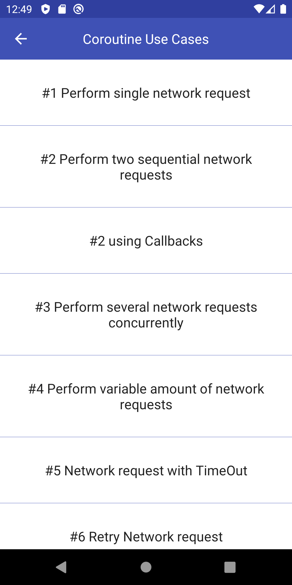

For the last couple of weeks, I worked really hard on a new open-source project called [Kotlin Coroutines – Use Cases on Android](https://github.com/LukasLechnerDev/Kotlin-Coroutine-Use-Cases-on-Android). Today, I am really proud to present “Version 1.0” to you!

It currently consists of 16 self-contained implementations of common real-world use cases for using Coroutines on Android. These use cases are all about performing network requests sequentially and concurrently, using timeouts, performing retries, using Coroutines together with Room and WorkManager and performing expensive processing on background threads. It also has examples for “Cooperative Cancellation” and Exception Handling. You can find more information on the [project readme](https://github.com/LukasLechnerDev/Kotlin-Coroutine-Use-Cases-on-Android/blob/master/README.md). It also includes unit tests, of course 😉.

MainActivity with a list of all the use cases

## Motivation ⭐️

This is the project I wish I had when I started to learn Coroutines. It is easy to use (no setup like e.g. inserting API keys needed; just clone and run it) and easy to understand (simple architecture, self-contained implementations). If you are new to Coroutines, it will show you how to implement common Android use cases with Coroutines. You will learn them in an efficient and fun way.

But even if you already have experience with Coroutines, this repository can be a helpful companion for you. So whenever you face a tricky multithreading problem, this project is here to help you by either showing you examples similar to your problem or giving you a solid playground where you can try out your coroutine related logic very quickly.

## Outlook 🔭

I also want to add use cases for the usage of Kotlin Coroutine – **Channels and Flow** in the future. Star the project or sign up to my newsletter in order to get information about major updates in the future.
