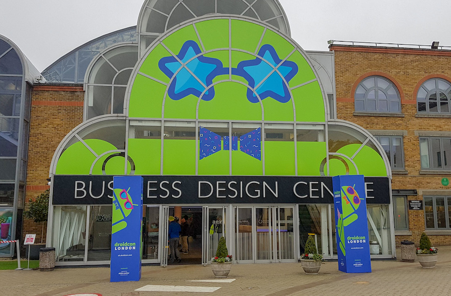
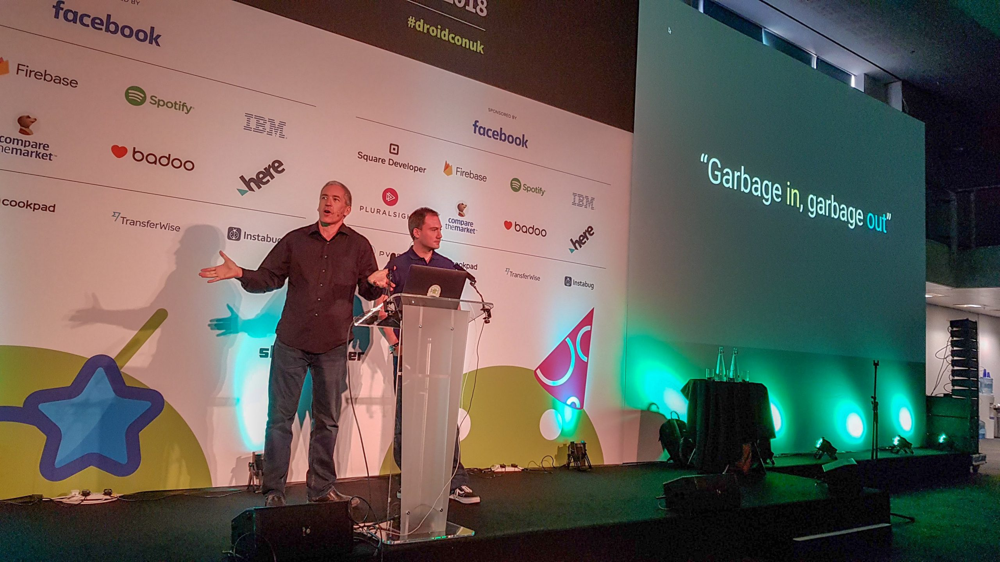
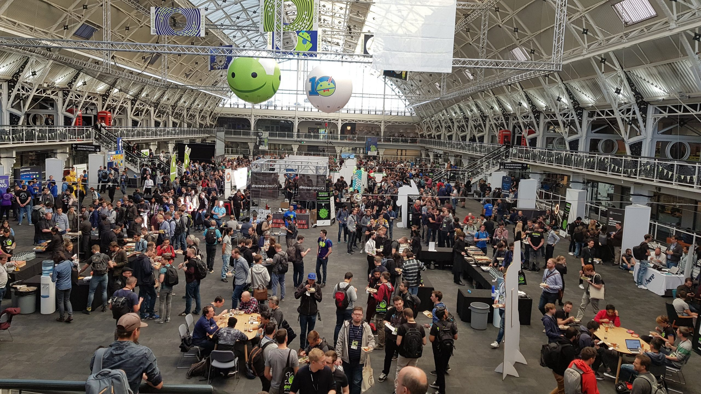
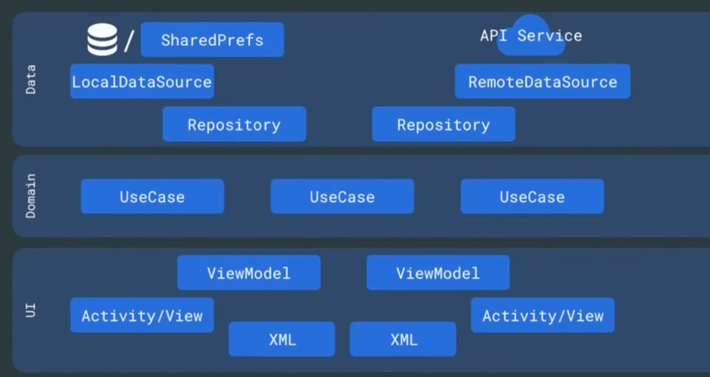
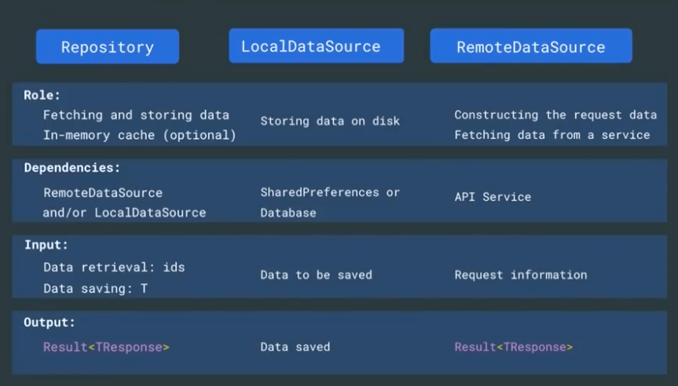
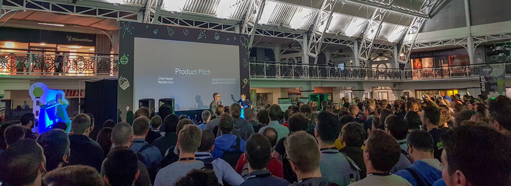
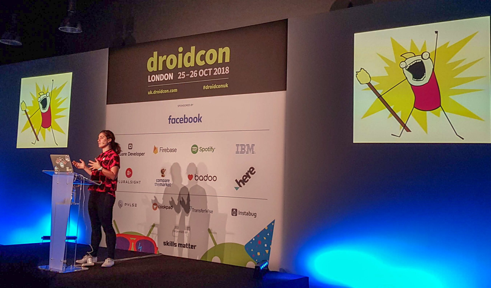
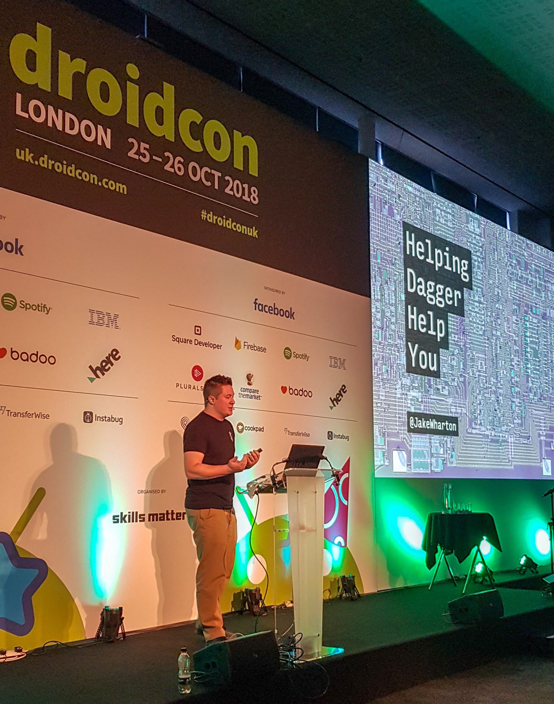

I attended Droidcon London on the 27th and 28th of October 2018. I made it a habit to write a blogpost about all the things I learned after every conference. This forces me to listen to the talks very carefully and find out the essence of the presentation and then afterwards put my learnings into words in a clear and comprehensible way.

## Day One

We arrived really early at the venue on the first day and got a seat in the first row for the **“Trash Talk”** keynote from **Chet Haase** and **Romain Guy**. They talked about the evolution of garbage collection on Android. In the “early” days of Android (4.4 and below), garbage collection was very expensive, so Google gave the advice, that you should be really careful to not allocate more objects and therefore memory than really necessary. With the new Android Runtime (ART), garbage collection got more efficient in each new version of the Android framework. They explained how the optimisations for garbage collection work in great detail. Nowadays, it is not that important anymore to put a lot of focus on avoiding object allocations, hence developers should focus on writing good and comprehensible code.

_Keynote by Chet Haase and Romain Guy about the evolution of garbage collection on Android_

In the next talk, **Milena Nikolic** from the Google Play App Distribution team talked about new features like the **“Android App Bundle”** and “**Dynamic Delivery”**. The new app publishing format of “Android App Bundle” enables much smaller APK sizes, because users are downloading APKs that only contain resources that are specific for their device. This is important, because smaller APK sizes mean more downloads and fewer uninstalls. She said that one out of five apps gets deinstalled in order to free up space. The “Dynamic Delivery” features makes it possible for users to install additional features for an app on demand. Another cool feature that she presented was “In-App Updates”, which make it possible to update an app directly in the app itself. So we don’t need to link the user to the Play Store and tell him to manually update the app anymore, which drastically improves the usability.

Then I watched the talk **“Modern Data Binding”** from **Jose Alcerreca** and **Yigit Boyar**. They talked a lot about the basics of Data Binding. The interesting part was how Data Binding now plays together with other components of Android Architecture Components. For Instance you can use `LiveData` objects instead of `ObservableFields` as the data binding source. Then the UI gets automatically notified about changes in the data.

**Tomek Polanski** then talked about how he **convinced his company Groupon to use Flutter**. He explained how you can assess in you company whether or not Flutter is a viable option.

_the exhibition hall during breaks_

Then, **Nish Tahir** talked about his experiences with **Redux on Android**. The Redux architecture has its origins in web frameworks and is about strict unidirectional data flow where all data flows in one direction through components. Main elements of Redux are a Store (state container), Actions and Reducers. The store holds your entire app state. Actions represent how we want our state to be changed. Reducers provide pure functions which take a State and an Action, and emit a new State. Views become simple visualisations of the app state. An advantage is that it is really easy to unit test the reducers. Drawbacks are that a lot of boilerplate is necessary (Kotlin can help here) and the learning curve is very steep. Redux fits best for apps that are really state driven, like media players.

Then we attended two short lightning talks. In the first one, **Xavier Gouchet** presented his [fuzzy testing library](https://github.com/xgouchet/Elmyr), that provides random values for each unit test instead of the typical hardcoded values like “bob” for Strings and 42 for Integers. The benefit is that you are then testing different paths of your code for every unit test.

The keynote from **Florina Muntenescu** about **“Pragmatic Crafting”** was one of my favourite talks of the conference. She talked about the important balance between going too fast during development and neglecting architecture and clean coding principles, which leads to unmaintainable projects in the long term, and over-engineering “hollow skyscrapers of architecture”, which take a long time to build, but aren’t that maintainable as we initially think they are. In the last couple of months, she worked together with other engineers on refactoring an app called [Plaid](https://github.com/nickbutcher/plaid), which was created in 2016 as a showcase app for material design but degraded over time into a broken app with lots of technical debt.

_Architecture Overview of the Refactoring of Plaid_

The technical details about the refactoring are

*   Preferring Kotlin Coroutines over RxJava for asynchronous operations.
*   Coroutines are launched and cancelled in ViewModels.
*   UseCases and Repositories expose suspending functions.
*   ViewModels expose LiveData objects, which emit UI-States.
*   Kotlin Sealed Classes and the new Inline Classes are used for increased type safety.

Another valuable advice was to define guidelines (roles, dependencies, inputs and outputs) for each component in your architecture (e.g. ViewModel, UseCase, Repository, DataSource) so that you have a common understanding within your team.

_guidelines for different components of Plaid app_

After the brilliant keynote, it was time for the Droidcon London 10 years anniversary party. **Chet Haase** & **Romain Guy** entered the stage again for a really funny comedy talk. Afterwards, the Bad Android Advice Quiz took place, where two teams that consisted of big names from the Android community competed against each other. It was really hilarious and very entertaining.

_comedy talk by Chet Haase & Romain Guy @ after party_

## Day Two

Day Two kicked off with a keynote from **Hadi Hariri** talking about **Refactoring to Functional** in which he showed the audience how to use functions instead of objects as our primitive building blocks for writing applications to achieve more concise and comprehensible code. That means that we write functions to which you can pass other functions as parameters (higher order functions) or return other functions. Important concepts in Functional Programming are immutable objects, pure functions and avoidance of mutable shared state. He presented some data types like `Either`, `Valid` , `Option` or `Try`, which are contained in a library called `[arrow](https://github.com/arrow-kt/arrow)` and help with Functional Programming.

**Christina Lee** talked about **Coroutines By Example**. She started with some theory in form of “things you need to know about Coroutines”:

*   Coroutine Builders like `launch{}` and `async{}` are bridges between synchronous and suspend code.
*   Coroutine Dispatchers define where ( main, io, …) the work of the coroutine should be executed. Each Coroutine runs in an initial Coroutine Dispatcher. With Coroutines, there is no such concept of an `upstream` or `downstream`. `withContext()` in the Coroutine space is like `observeOn` in the Rx space. So we can have block scopes.
*   A job in the Coroutine space is like a disposable in the Rx space and needs to be canceled if it is no longer needed.
*   Coroutines are synchronous by default. Concurrency in coroutines is explicit and Opt-in.
*   You can get the job, the name and other properties from a`CoroutineContext`. You can extend a `CoroutineContext` with some error handling logic for instance, which is then accessible for all Coroutines that run in that context.
*   Rx Flowables can be implemented via channels in the Coroutines domain.

In the practical part, she replaced in a small project RxJava with Kotlin Coroutines via live coding, which worked out pretty well 👍.

_Christina Lee talking about “Coroutines by example”_

In a very advanced technical talk, **Jake Wharton** spoke about some pain points of **Dagger,** like the boilerplate that is sometimes needed and the slow build speed because of annotation processing. He presented some libraries which are built on top of Dagger and reduce these pain points. `[AssistedInject](https://github.com/square/AssistedInject)` helps reducing the boilerplate needed for objects that have dependencies that get provided by Dagger and also parameters, that have to be passed. This works through generating factories by the annotation processor.

He then spoke about an interesting library on which he is currently working on, called `dagger-reflect` . The idea is to use reflection for `debug` builds or builds triggered from the IDE to speed up the build time, because no annotation processor would need to run. For `release` builds, we would still rely on annotation processing, so we don’t have any performance downside there.

`dagger-reflect` is currently part of his side project called `[SdkSearch](https://github.com/JakeWharton/SdkSearch/tree/master/dagger-reflect)`, but might be extracted into a separate library or included directly into Dagger.

_Jake Wharton giving a really advanced talk about libraries on top of Dagger_

## Sumary

It was definitively worth travelling to London and visit Droidcon. It was certainly the best conference I have ever attended. The two days were packed with high quality talks from really awesome and popular developers. I never had two of such intense days before, where my brain got filled with so much valuable content. Also the organisation of the event was very professional. It is really likely that I show up next year too 😃.
