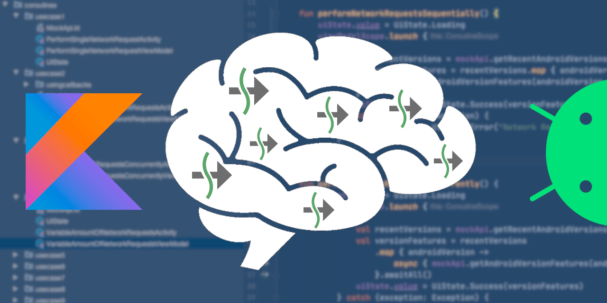
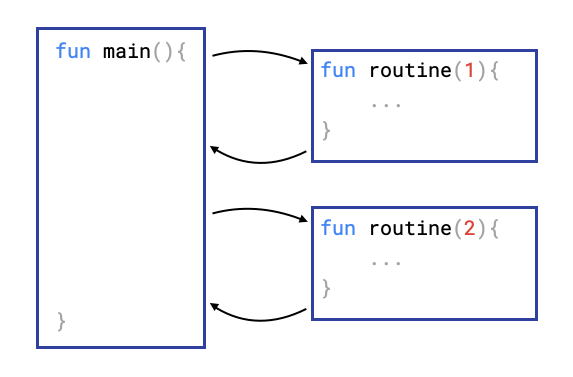
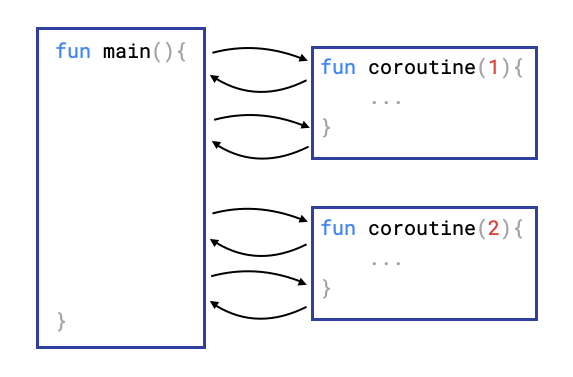
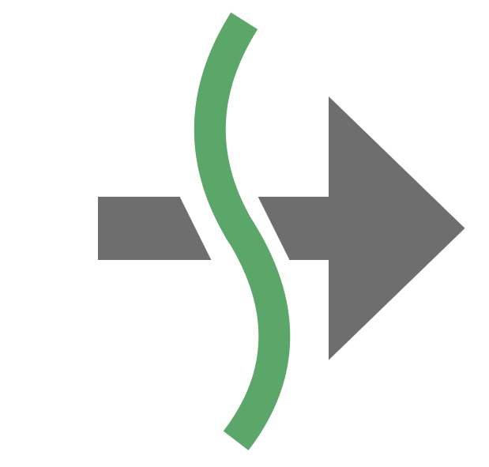
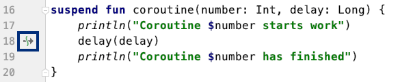

For the majority of developers, the concept of a coroutine is pretty unfamiliar, although the first ideas date back to the early sixties. This is because we started to learn Software Development with programming languages like Java, in which the concept of a coroutine simply does not exist. What we did learn, however, are how basic concepts like classes, functions, and interfaces work. Over time, we developed a fundamental understanding of these essential, yet abstract concepts.

Every Android developer will sooner or later get in touch with the concept of “coroutines” for the Kotlin programming language. When developers go through some online resources to learn about coroutines, what they most often get are oversimplifications like “coroutines are like light-weight threads” or code snippets about implementing some “Hello World” behavior. In the real world, when requirements are often more complex, their insufficient understanding of coroutines fails them to develop efficient and correct concurrent software.

This blog post will help you to form a solid mental model about this new emerging concept for modern software development. It will define 5 important building blocks on which your understanding will be based. This fundamental understanding will help you develop your concurrent applications successfully.

This blogpost is most helpful for developers, who already have some experience with coroutines but still aren’t able to completely wrap their heads around them.

ℹ️ _You can also check out my [new open source project](https://github.com/LukasLechnerDev/Kotlin-Coroutine-Use-Cases-on-Android), in which I developed 16 sample implementations of the most common use cases of Kotlin Coroutines for Android Development. I think you will find it helpful_.

## What exactly is a "mental model"? 🧠

> Mental models are how we understand the world.

> Mental models are how we simplify complexity, \[…\]

> A mental model is simply a representation of how something works.

Source: [Mental Models by Farnam Street](https://fs.blog/mental-models/)

Most of us (me included) don’t even understand basic things in life to their full extend. We know, for instance, that gravity pulls things towards the earth, but don’t really know the exact physical reasons for this. We don’t have to know all the details, we just have to have a sufficient understanding of gravity in order to survive or make practical decisions like not jumping from a diving platform into a pool that is unfilled.

The same is true for programming. We don’t need to know much about electricity, how exactly the CPU works, or every detail that compilers do. We can write software without detailed knowledge because we rely on abstractions and high-level programming languages that simplify complexity. However, it is still useful to have a mental representation of how these underlying components work.

In order to be able to successfully develop applications with coroutines, it is not necessary, to know all the source code in the coroutines library or the exact functioning of the compiler, however, a basic mental model about the coroutines machinery is essential to understand how code in coroutines is executed in contrast to regular code.

## Routines and Coroutines

Let’s start our journey with an analysis of the term itself:


It consists of CO and ROUTINE. Every developer is familiar with ordinary routines. They are also called subroutines or procedures, but in Java and Kotlin they are known as functions or methods. Routines are the basic building blocks of every codebase.

A routine, according to Wikipedia, is a

> sequence of program instructions, that performs a specific task, packaged as a Unit. This unit can then be used in programs wherever that particular task should be performed.

The following simple code snippet shows the control flow of regular routines:

```kotlin
fun main() {
    println("main starts")
    routine(1, 500)
    routine(2, 300 )
    println("main ends")
}

fun routine(number: Int, delay: Long) {
    println("Routine $number starts work")
    Thread.sleep(delay)
    println("Routine $number has finished")
}

// ======================================================
// print output:

// main starts
// Routine 1 starts work
// Routine 1 has finished
// Routine 2 starts work
// Routine 2 has finished
// main ends
// ======================================================
```

An important and very intuitive characteristic of a regular routine is that when it is invoked, its body is executed completely, from top to bottom and once the routine’s task is done returns the control flow back to the call site. You can see this in the print output, where routine 1 finishes its work before routine 2 starts its own work. For simplicity, `Thread.sleep()` is used here to represent either some kind of work or the time needed to wait for a response from an external system. The following diagram illustrates the control flow:



Now, that we know the characteristics of a regular routine, let’s have a closer look at coroutines. Co stands for cooperative. What follows is a similar example that uses coroutines instead of regular routines:

```kotlin
fun main() = runBlocking {
    println("main starts")
    joinAll(
        async { coroutine(1, 500) },
        async { coroutine(2, 300) }
    )
    println("main ends")
}

suspend fun coroutine(number: Int, delay: Long) {
    println("Coroutine $number starts work")
    delay(delay)
    println("Coroutine $number has finished")
}

// ======================================================
// print output:

// main starts
// Routine 1 starts work
// Routine 2 starts work
// Routine 2 has finished
// Routine 1 has finished
// main ends
// ======================================================
```

Here, we use the `suspend` function `delay()` to represent some kind of work. As you can see in the print output, the two coroutines are not executed completely before returning the control flow, as regular routines do. Instead, they are only executed partially, then get suspended and return back the control flow to other coroutines in the middle of their execution. That’s why they are called cooperative routines – they can pass execution back and forth between each other.

You can verify this characteristic by investigating the print output: Routine 2 was started even before Routine 1 finished! The following diagram now illustrates the control flow of coroutines:



Coroutines can be suspended at every “suspension point”. You might wonder what exactly a “suspension point” is. It is basically every point when a coroutine calls a `suspend` function. In Android studio, each call to a suspend function is marked by the following symbol in the gutter on the left:



In our example coroutine, the `suspend` function `delay()` is a suspension point and therefore Android Studio shows this special icon in the gutter:



* * *

## 🧱 Mental Model Building Block Number 1

**With coroutines, it is possible to define blocks of code that are executed only partially before returning the control flow back to the call site. This works because coroutines can be suspended at suspension points and then resumed at a later point in time.**

* * *

## Coroutines and Threads 🧵

Well, you might say that you can achieve the same behavior as in the last example with routines by starting a new thread every time you call the routine. This is true, as the following code example illustrates:

```kotlin
fun main() {
    println("main starts")
    threadRoutine(1,500)
    threadRoutine(2,300)
    Thread.sleep(1000)
    println("main ends")
}

fun threadRoutine(number: Int, delay: Long) {
    thread {
        println("Routine $number starts work")
        Thread.sleep(delay)
        println("Routine $number has finished")
    }
}

// ======================================================
// Print output:

// main starts
// Routine 1 starts work
// Routine 2 starts work
// Routine 2 has finished
// Routine 1 has finished
// main ends
// ======================================================
```

As you can see, we get the same print output as in the coroutine example. However, when using coroutines, you don’t need to create threads to get concurrent behavior! All code in the coroutine example is executed on the main thread. Threads consume a considerable (1-2 MB per thread) amount of memory and switching between them is quite expensive.

* * *

### 🧱 Mental Model Building Block Number 2

**Coroutines allow you to achieve concurrent behavior without switching threads, which results in more efficient code. Therefore, coroutines are often called “lightweight threads”.**

