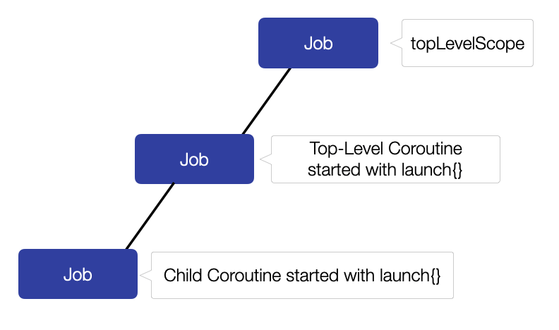
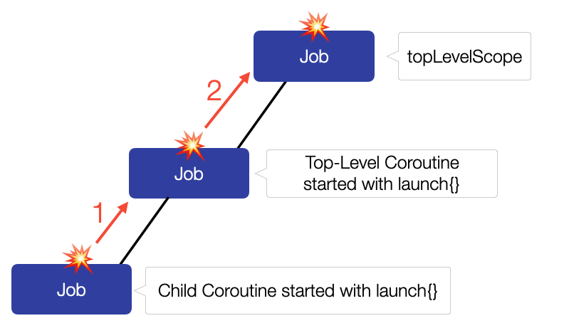

Exception handling is probably one of the hardest parts when learning Coroutines. In this blog post, I am going to describe the reasons for its complexity and give you some key points that will help you to build a good understanding of the subject. You will then be able to implement a successful exception handling infrastructure in your own applications.

> Info: You can watch an even more comprehensive video about Exception Handling in Kotlin Coroutines [here](https://youtu.be/Pgek3_3vPU8)!

## Exception handling in pure Kotlin

Exception handling in pure Kotlin code (without Coroutines) is pretty straight forward. We basically only use the `try-catch` clause to handle exceptions:

```kotlin
try {
    // some code
    throw RuntimeException("RuntimeException in 'some code'")
} catch (exception: Exception) {
    println("Handle $exception")
}

// Output:
// Handle java.lang.RuntimeException: RuntimeException in 'some code'
```

If an exception is thrown inside a regular function, this exception is “re-trown” by the function. This means that we are able to use a `try-catch` clause to handle the exception on the call site:

```kotlin
fun main() {
    try {
        functionThatThrows()
    } catch (exception: Exception) {
        println("Handle $exception")
    }
}

fun functionThatThrows() {
    // some code
    throw RuntimeException("RuntimeException in regular function")
}

// Output
// Handle java.lang.RuntimeException: RuntimeException in regular function
```

## `try-catch` in Coroutines

Let’s now have a look at the usage of `try-catch` with Kotlin Coroutines. Using it inside a Coroutine (which is started with `launch` in the example below) works as expected, as the exception is caught:

```kotlin
fun main() {
    val topLevelScope = CoroutineScope(Job())
    topLevelScope.launch {
        try {
            throw RuntimeException("RuntimeException in coroutine")
        } catch (exception: Exception) {
            println("Handle $exception")
        }
    }
    Thread.sleep(100)
}

// Output
// Handle java.lang.RuntimeException: RuntimeException in coroutine
```

But when we `launch` another Coroutine inside the `try` block …

```kotlin
fun main() {
    val topLevelScope = CoroutineScope(Job())
    topLevelScope.launch {
        try {
            launch {
                throw RuntimeException("RuntimeException in nested coroutine")
            }
        } catch (exception: Exception) {
            println("Handle $exception")
        }
    }
    Thread.sleep(100)
}

// Output
// Exception in thread "main" java.lang.RuntimeException: RuntimeException in nested coroutine
```

… you can see in the output that the exception isn’t handled anymore and the app crashes. This is _very_ unexpected and confusing. Based on our knowledge and experience with `try-catch`, we expect that every exception within a `try` block is caught and enters the `catch` block. But why isn’t this the case here?

Well, a Coroutine that doesn’t catch an exception by itself with a `try-catch` clause, “completes exceptionally” or in simpler terms, it “fails”. In the example above, the Coroutine started with the inner `launch` doesn’t catch the `RuntimeException` by itself and so it fails.

As we have seen in the beginning, an uncaught exception in a regular function is “re-thrown”. This is _not_ the case for an uncaught exception in a Coroutine. Otherwise, we would be able to handle it from outside and the app in the example above wouldn’t crash.

So what happens with an uncaught exception in a Coroutine then? As you probably know, one of the most innovative features of Coroutines is [Structured Concurrency](https://kotlinlang.org/docs/reference/coroutines/basics.html#structured-concurrency). To make all the features of Structured Concurrency possible, the `Job` object of a `CoroutineScope` and the `Job` objects of Coroutines and Child-Coroutines form a hierarchy of parent-child relationships. An uncaught exception, instead of being re-thrown, is “propagated up the job hierarchy”. This exception propagation leads to the failure of the parent `Job`, which in turn leads to the cancellation of all the `Job`s of its children.

The job hierarchy of the code example above looks like this:



The exception of the child coroutine is propagated up to the `Job` of the top-level Coroutine (1) and then up to the `Job` of `topLevelScope` (2).



Propagated exceptions can be handled by installing a `CoroutineExceptionHandler`. If none is installed, the uncaught exception handler of the thread is invoked, which, depending on the platform, will probably lead to a print out of the exception followed by the termination of the application.

In my opinion, the fact that we have two different mechanisms for handling exceptions – `try-catch` and `CoroutineExceptionHandler`s – is one of the main factors why exception handling with Coroutines is so complex.

### 💥 Key Point #1

**If a Coroutine doesn’t handle exceptions by itself with a `try-catch` clause, the exception isn’t re-thrown and can’t, therefore, be handled by an outer `try-catch` clause. Instead, the exception is “propagated up the job hierarchy” and can be handled by an installed `CoroutineExceptionHandler`. If none is installed, the uncaught exception handler of the thread is invoked.**

